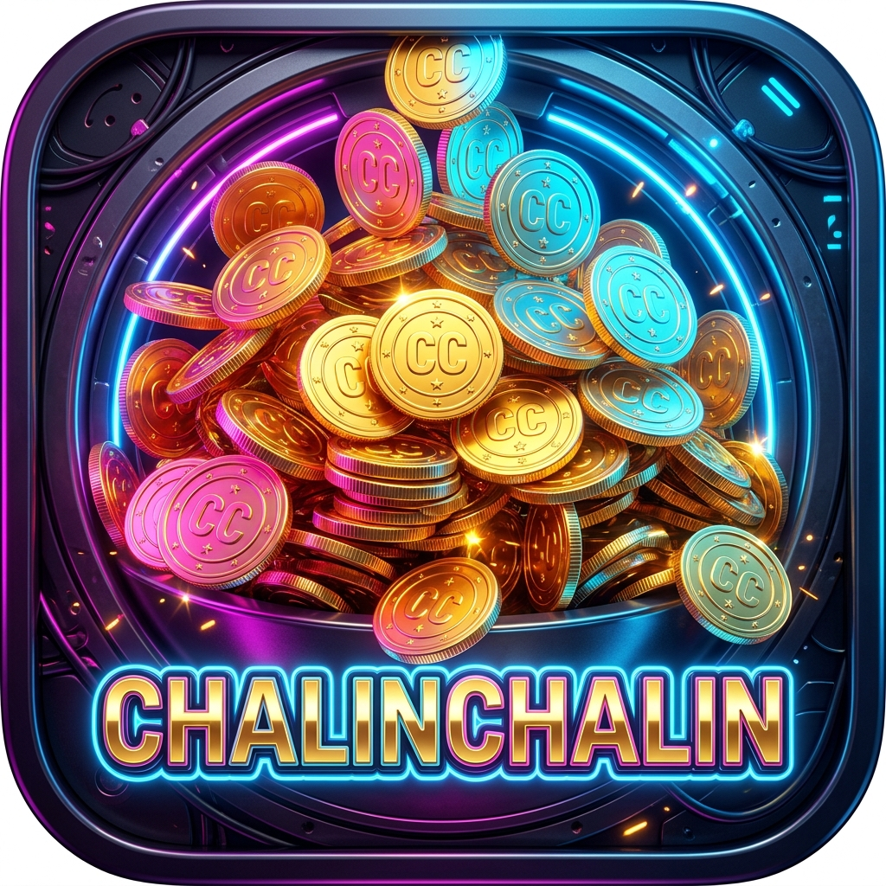
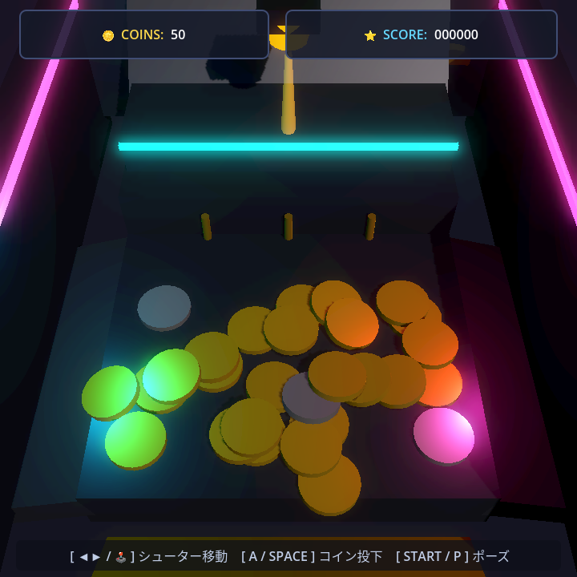

# ChalinChalin 3D Coin Pusher (チャリンチャリン 3Dコインプッシャー)

<div align="center">
  
  <br />
  <strong>Android 物理コントローラー内蔵携帯機（RG Rotate）向け 3D物理演算コインプッシャー</strong>
</div>

---

## 📱 実機スクリーンショット (RG Rotate / 720 × 720)

<div align="center">
  
</div>

---

## 🎮 主な機能・仕様

1. **3D物理演算コインプッシャー**:
   - 2段構造のアーケードステージ（上段・下段）
   - `AnimatableBody3D` による2段押し出しプッシャー（上段スライダー + 下段コイン直接押し出しフロントブレード）
   - 背後ガードスロープにより、投下したコインが奥に落ちることなく確実に盤面手前へ誘導
   - `RigidBody3D` 物理コイン（ゴールド金貨、シルバー銀貨、レアネオンルビー金貨）
   - 突き抜け防止（Continuous Collision Detection）、スリープ最適化による高パフォーマンス（60FPS維持）
   - 画面内コイン上限管理システム（最大120枚）

2. **ゲームルール & 永続セーブシステム**:
   - シューターを左右に動かし、コインをステージ上段に投下。
   - 手前の払い出し口（`WinZone`）に落ちたコインを獲得（コイン数加算、スコア獲得、コンボ倍率）。
   - 左右の溝（`LoseZone`）に落ちたコインは没収（即時回収・パフォーマンス維持）。
   - **セーブデータ永続化**: 所持コイン、ハイスコア、累計獲得枚数は `user://save_data.json` に自動保存され、アプリ終了・再起動後もコインが引き継がれます。
   - **コイン自動救済システム**: コインが25枚未満になると、3.5秒ごとに1枚ずつ自動補給（COINS表示の真下に `⚡ RECOVERY +1` 通知）。手持ちが尽きてもエンドレスに再開可能。

3. **プロシージャル・アーケードサウンド**:
   - 外部音声ファイル不要のプロシージャル合成シンセサウンド（コイン投下音、獲得ファンファーレ、ポーズ音など）。

---

## 🕹️ 操作方法 (Input Map)

| 操作 | ゲームパッド (RG Rotate / Xbox配列) | キーボード (PCデバッグ) | 挙動 |
| :--- | :--- | :--- | :--- |
| **シューター移動** | 左右スティック / 十字キー ◄ ► | `A` / `D` または `◄` / `►` | シューター（投入口）の左右スライド |
| **コイン投下** | `Aボタン` (`btn_a` / 下ボタン) | `SPACE` / `ENTER` / `Z` | コイン投下（押しっぱなしで0.25秒連射） |
| **ポーズ開閉** | `START` (`btn_start` / Menu) | `ESC` / `P` | ポーズメニューの開閉 |
| **メニュー操作** | 十字キー ▲ ▼ + `Aボタン`(決定) / `Bボタン`(戻る) | 矢印キー + `Enter` / `ESC` | コントローラー完全対応のフォーカス移動 |

---

## 📱 ディスプレイ・解像度仕様

- **Base Viewport**: `720 × 720` (正方形解像度・RG Rotate最適化)
- **Stretch Mode**: `canvas_items`
- **Stretch Aspect**: `keep`
- **カメラ**: 固定クォータービュー（画角46度）、どの画面比率でも盤面全体が綺麗に収まるレイアウト。

---

## 🚀 実行方法

### PCでの直接実行
```powershell
godot --path .
```
または Godot Editor 4.x でプロジェクトを開いて `F5` キーで実行。

### 自動検証テストの実行
```powershell
godot --headless -s res://tests/test_gameplay.gd
```